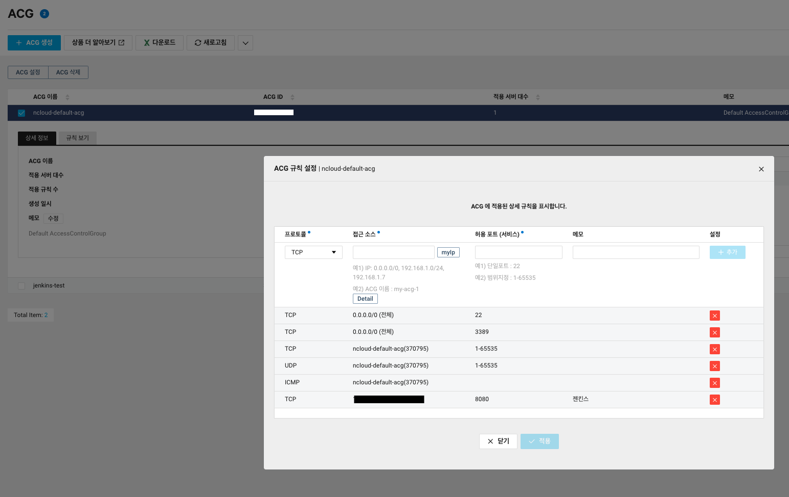

Server : 네이버클라우드 우분투 

#### Step1. openJdk11 설치
```bash
sudo apt-get install openjdk-11-jdk
```

#### Step2. Jenkins 설치
Key 추가
```bash
wget -q -O - https://pkg.jenkins.io/debian/jenkins-ci.org.key | sudo apt-key add -
```
OK가 리턴되면, 서버의 sources list에 Debian패키지 저장소 주소를 추가 
```bash
echo deb https://pkg.jenkins.io/debian-stable binary/ | sudo tee /etc/apt/sources.list.d/jenkins.list
echo "deb https://pkg.jenkins.io/debian-stable binary/" > /etc/apt/sources.list.d/jenkins.list
```
저장소 업데이트 후 Jenkins설치
```bash
sudo apt-get update
```
```bash
sudo apt-get install jenkins
```

#### Step3. Jenkins 시작확인
젠킨스 시작 멍령어
```bash
sudo systemctl start jenkins
```
젠킨스 서버 상태 명령어
```bash
sudo systemctl status jenkins
```
```output
● jenkins.service - LSB: Start Jenkins at boot time
   Loaded: loaded (/etc/init.d/jenkins; generated)
   Active: active (exited) since Tue 2021-05-18 01:24:20 KST; 2min 52s ago
     Docs: man:systemd-sysv-generator(8)
    Tasks: 0 (limit: 1096)
   CGroup: /system.slice/jenkins.service
```

#### Step4. 네이버 클라우드 ACG 설정 


#### Step5. 젠킨스 접속 및 플러그인 설치 
```bash
cat /var/lib/jenkins/secrets/initialAdminPassword
```
출력되는 패스워드를 입력한 후 플러그인을 설치한다.


[Refference]  
 - [설치튜토리얼](https://www.digitalocean.com/community/tutorials/how-to-install-jenkins-on-ubuntu-16-04)
 